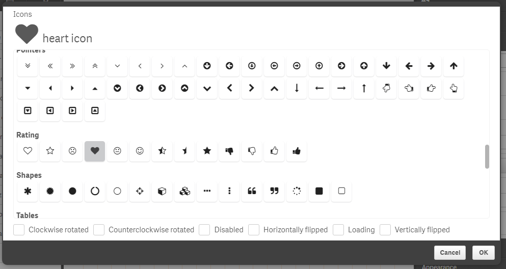

# Simple KPI

Simple KPI component for Qlik Sense.
It can show one or several KPI using measures and one dimension (optional, it can show up to 255 values).
Supports adaptive design, conditional css colors, conditional icons, configurable number of kpis per line, several predefined sizes, custom styles (CSS).
Each measure can have a link to another sheet.


## Installation

Download [build/qsSimpleKPI.zip](https://github.com/alner/qsSimpleKPI/raw/master/build/qsSimpleKPI.zip), upload to qlik server or extract to appropriate folder.

Qlik Sense Desktop: unzip to a directory under [My Documents]/Qlik/Sense/Extensions.

Qlik Sense Server: import the zip file in the QMC.

## Demo

Download [SimpleKPIDemo.qvf](examples/SimpleKPIDemo.qvf)


## Configuration


You can set icon for value or label (full icons set included).



**Conditional colors**


**Conditional icons**


**Custom styles**

 You can fully customize kpis using "Styles (CSS)" property.
 For testing purpose just copy and paste the following styles into the "Styles (CSS)" property.

 ```
@import url('https://fonts.googleapis.com/css?family=Indie Flower');
@import url('https://fonts.googleapis.com/css?family=Fredoka One');

& .label {
  font-family: 'Fredoka One';
  font-size:  300%;
}

& .statistic-1  .value {
  background-color: green;
  font-family: 'Indie Flower', sans-serif;
  color: white !important;
}

& .value {
  background-color: yellow;
  font-family: 'Indie Flower', sans-serif;
  font-size: 900%;
  color: red !important;
}
 ```

 

For example, you can import "Font Awesome" and use it. Just copy and paste the following styles into "Styles (CSS)" property.
```
@import url('https://maxcdn.bootstrapcdn.com/font-awesome/4.5.0/css/font-awesome.min.css');
```

Just copy and paste appropriate classes ([see icons](https://fortawesome.github.io/Font-Awesome/icons/)) into the "Icon" measure's property.
For example, copy and paste the following into the "Icon" property.
```
fa fa-calendar
```


## Maintainers

[alner](https://github.com/alner)

## License

MIT
